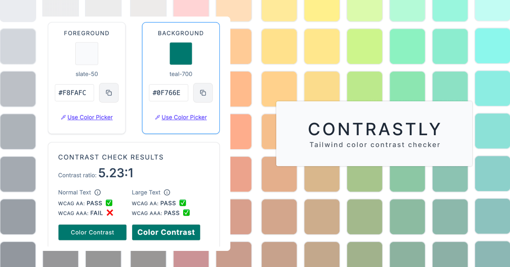

# Hi, I'm Yoko — Independent Frontend Engineer 👋

I work across React, Next.js, TypeScript, accessibility-aware UI, and product-facing frontend implementation.

I run Sola Studio, an independent frontend-focused practice supporting teams with frontend implementation, accessibility review and remediation, UI/UX review, Japan-facing UX and messaging support, and product clarity.

I often work on the parts of a product where UI implementation, API behaviour, data flow, accessibility, product logic, user expectations, and team communication need to line up. I care about making product screens easier to understand, implement, maintain, and improve across layers.

## Focus areas

- Frontend implementation with React, Next.js, and TypeScript
- Accessibility-aware UI implementation
- Accessibility review and remediation support through Sola Studio
- Product-facing frontend support
- UI, API, and data-flow collaboration
- UX-aware screen and component structure
- UI/UX review for pages, forms, flows, and product screens
- Japan-facing UX and messaging support through Sola Studio
- Internal tools, dashboards, and data-heavy product screens
- Clear written communication in distributed teams

---

## Main projects

### Contrastly — Open-source Tailwind Color Contrast Checker

A lightweight open-source color contrast checker for Tailwind CSS palettes, custom hex values, and semantic color token decisions.

Built for frontend developers, designers, and anyone who needs to check contrast quickly while working on UI.

Originally created as a small practical tool, then cleaned up and released as open source through Sola Studio.

**Stack:** Next.js / TypeScript / Tailwind CSS / Accessibility-aware UI

- [Open app](https://contrastly.solastudio.studio/)
- [Source code](https://github.com/sola-studio/contrastly)

---

### Promotee — Interview Flashcard App

An interview practice app built with accessibility considered from the start.

Built for practicing answers out loud, reviewing prompts, and supporting a clearer interview preparation flow.

**Stack:** Next.js / TypeScript / Tailwind CSS / Zustand / Accessibility-aware UI

- [Try the app](https://www.promotee.app/)
- [Read the story on Medium](https://medium.com/@yokoworks.dev/what-building-my-first-a11y-focused-app-taught-me-7a2811de2fb1)

---

## Selected work

- **Internal data dashboards** — dashboard wireframes, CSV-driven workflows, requirements structuring, and React / TypeScript UI prototyping for data-heavy internal tools.
- **Web3 EdTech Platform** — frontend implementation across async collaboration, API contracts, authentication flows, wallet connection, and certificate issuance.
- **Automated PDF Report Tool** — React-based internal reporting tool with data handling, chart rendering, and automated PDF generation.
- **UX-Oriented Website Redesign** — information architecture and flow restructuring for a corporate website redesign.
- **Accessibility review and remediation support** — review and implementation support through Sola Studio, focused on selected pages, flows, components, WCAG 2.2 AA-related issues, prioritised findings, and practical frontend remediation.
- **Japan-facing UX and messaging support** — work through Sola Studio focused on Japan-facing pages, messages, materials, and flows, with attention to UX, messaging, wording, trust signals, information order, decision flow, and market-facing clarity.

---

## How I work

I focus on clarifying requirements, sharing decisions clearly, and building frontend systems that stay understandable across product, design, engineering, and operations.

Accessibility is part of how I make implementation decisions. I see it not only as compliance work, but as a practical way to improve UI quality, interaction design, and real-world usability.

I also care about the friction that appears between layers: design intent, frontend behaviour, API structure, data flow, business requirements, user expectations, and communication context.

---

## Writing

I write about accessibility, frontend work, UX, communication, and product friction that is easy to overlook in everyday delivery.

- [What Building My First A11y-Focused App Taught Me](https://medium.com/@yokoworks.dev/what-building-my-first-a11y-focused-app-taught-me-183fbf1c3ea9)  
  Featured in JavaScript in Plain English

- [From Universal Design to Personalized Interfaces](https://medium.com/@yokoworks.dev/from-universal-design-to-personalized-interfaces-rethinking-accessibility-3f0d9b31150b)  
  Featured in Bootcamp / UX Collective

- [The UX Lesson I Learned in a Quiet Tokyo Salon](https://medium.com/@yokoworks.dev/the-ux-lesson-i-learned-in-a-quiet-tokyo-salon-1fa61e7e15b7)  
  Featured in Bootcamp / UX Collective and selected for Boost

---

## Links

- [Sola Studio](https://solastudio.studio/international)
- [Sola Journal](https://www.solajournal.org)
- [LinkedIn](https://www.linkedin.com/in/yokoworks/)
- [Medium](https://medium.com/@yokoworks)
